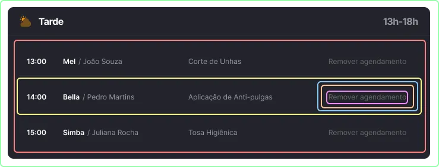

# Introdução

Biblioteca JavaScript de código aberto com foco em criar interfaces de usuário (frontend) em páginas web. É mantido pelo Facebook, Instagram, outras empresas e uma comunidade de desenvolvedores individuais. É utilizado nos sites da Netflix, Imgur, Feedly, Airbnb, SeatGeek, HelloSign, Walmart e outros.

## React, a biblioteca para interfaces web e nativas

### **O que o React NÃO é**

- **Um framework completo** → React é uma biblioteca focada na UI, não resolve coisas como roteamento, validação de formulários, requisições HTTP, internacionalização.
- **Um substituto do HTML, CSS e JS** → React usa o melhor do que temos de forma nativa para facilitar a manipulação de DOM. Você vai usar HTML, CSS e JavaScript.
- **Autossuficiente** → Precisa de outras bibliotecas (ex: React Router, Zod, React Hook Form, etc.) para construir aplicações completas.
- **Um renderizador apenas para web** → O core do React pode ser usado para aplicativos mobile (React Native), terminais (Ink), entre outros.

### **O que o React É**

- **Uma biblioteca para criar interfaces declarativas** → Você descreve como a UI deve ser com base no estado, e o React gerencia as mudanças no DOM.
- **Baseado em componentes** → A grande maioria do código é dividido em componentes reutilizáveis e isolados.
- **Reativo** → Atualiza a interface automaticamente quando o estado muda.
- **Unidirecional no fluxo de dados** → O estado flui de cima para baixo (de pai para filho), o que facilita o controle da aplicação.
- **Virtual DOM** → Usa uma representação virtual do DOM para fazer atualizações eficientes.

<aside>
💡

**Resumindo… O React é uma biblioteca para construir interfaces de usuário de forma declarativa e eficiente, mas não resolve tudo sozinho. Para aplicações reais você irá utilizar outras bibliotecas para compor o projeto.**

</aside>

---

## Tipos de aplicações web

Existem hoje duas formas principais para criar aplicações utilizando o React como base de renderização.

Em ambas as maneiras todo o carregamento da página é dinâmico e não precisa recarregar completamente o HTML vindo do servidor.

### **SPA - Single Page Application**

- É uma aplicação web que carrega uma única página HTML e atualiza dinamicamente.
- O navegador carrega um HTML básico junto com todos os arquivos de JavaScript e CSS.
- Pode ser hospedada em qualquer CDN (ex: AWS S3).

### **SSR - Server Side Rendering**

- É uma aplicação web que carrega uma única página HTML e atualiza dinamicamente
- O navegador carrega um HTML básico junto com os arquivos de JavaScript e CSS.
- É necessário um servidor NodeJS para hospedar a aplicação.

<aside>
💡

**Como saber o melhor para você? É importante analisar as vantagens e desvantagens de acordo com o cenário em que você está alocado e as tecnologias que você tem em mãos.**

</aside>

---

## Dom, Virtual DOM

### **DOM (Document Object Model**

- É a estrutura de árvore que os navegadores criam para representar o HTML da página no lado do JavaScript.

### **Virtual DOM**:

- É uma cópia leve do DOM real, mantida pelo React. Quando há mudanças no estado, o React atualiza primeiro o Virtual DOM, compara com a versão anterior (processo chamado **“diffing”**), e aplica apenas as mudanças necessárias no DOM real (processo chamado **“reconciliation”**), otimizando a performance.

<aside>
💡

**O Virtual DOM é como um "rascunho" eficiente do DOM real, permitindo atualizações mais rápidas e menos processamento pesado**

</aside>

## Árvore de Renderização

- Conhecida mundialmente como **“Render Tree”**, ela é usada pelo navegador para desenhar os elementos na tela, após toda a parte de diffing e reconciliation já finalizada.
- Essa estrutura permite que dados sejam enviados de cima para baixo. De componentes (elementos) pai para componentes (elementos) filho.

<aside>
💡

**Vale lembrar que todo esse processo é feito automaticamente pelo React. Você como dev não precisa fazer nada nessa parte de renderização direta no JavaScript.**

</aside>

---

## Como surgiu

### O caso “Chat do Facebook”

**Em 2011 quando a Meta (na época Facebook) decidiu criar o React foi por um motivo bem interessante.**

O **chat do Facebook** tinha um problema de **atualizações inconsistentes da UI**. Quando um usuário recebia uma nova mensagem, várias partes da interface precisavam ser atualizadas manualmente, o que tornava o código difícil de manter e cheio de bugs.


Para resolver isso o time deles criou uma ferramenta que conseguia manipular o DOM de maneira performática além de compartilhar os dados de maneira global na árvore de renderização. **Em 2011 nasce o** ‣ **React.js.**

**Em 2011 quando a Meta (na época Facebook) decidiu criar o React foi por um motivo bem interessante.**

O **chat do Facebook** tinha um problema de **atualizações inconsistentes da UI**. Quando um usuário recebia uma nova mensagem, várias partes da interface precisavam ser atualizadas manualmente, o que tornava o código difícil de manter e cheio de bugs.

Para resolver isso o time deles criou uma ferramenta que conseguia manipular o DOM de maneira performática além de compartilhar os dados de maneira global na árvore de renderização. **Em 2011 nasce o** ‣ **React.js.**

---

## “Componentização” e Reutilização

Graças a essa iniciativa acima, o React permite que você crie interfaces em pedaços individuais chamados de **“componentes”**. 

- Esses componentes podem ser reutilizados e compostos para formar interfaces mais complexas de maneira modular e organizada.
- Cada componente encapsula sua própria lógica e UI, tornando o código mais **manutenível** e **reutilizável**.
- Em sua maioria são **funcionais** (baseados em funções), pode ser que em projetos legados você veja classes.

Um dos principais recursos que a biblioteca entrega é **comunicação entre componentes** por meio de:

- **Propriedades →** dados passados de pai para filho
- **Contextos →** dados compartilhados de forma global na aplicação

Graças a essa iniciativa acima, o React permite que você crie interfaces em pedaços individuais chamados de **“componentes”**. 

- Esses componentes podem ser reutilizados e compostos para formar interfaces mais complexas de maneira modular e organizada.
- Cada componente encapsula sua própria lógica e UI, tornando o código mais **manutenível** e **reutilizável**.
- Em sua maioria são **funcionais** (baseados em funções), pode ser que em projetos legados você veja classes.

Um dos principais recursos que a biblioteca entrega é **comunicação entre componentes** por meio de:

- **Propriedades →** dados passados de pai para filho
- **Contextos →** dados compartilhados de forma global na aplicação

---

### Um exemplo prático

Um card que lista agendamentos de serviços pets.



‣ `<ScheduleCard />`

Contém o período do agendamento, juntamente com o horário e recebe como componente filho uma lista de horários.

‣ `<ScheduleList />` 

Desenha na tela a lista de agendamentos baseado em uma lista (array) recebida de uma API ou outra fonte de dados. Além de organizar o dado tabular via CSS.

‣ `<ScheduleListItem />`

Desenha uma linha contendo todas as informações do agendamento, como o horário, nome do pet e seu dono(a), o serviço a ser prestado, bem como um botão para remover o agendamento. Essa informação vem como um objeto do componente pai que é a listagem.

‣ `<ScheduleAction />`

O botão responsável por executar ações no item da lista, comumente essas ações são chamadas para alguma API de forma assíncrona. Esse botão pode ter outras variações, como por exemplo **“Editar agendamento”**.

‣ `<Button />`

Um botão que é completamente dinâmico. Esse é o famoso componente “atômico”, onde ele apenas lida com variações de estilos e comportamento. 

O texto **“Remover agendamento”** foi utilizado para esse caso de uso, mas qualquer texto pode ser utilizado em diferentes partes do projeto. Assim como diferentes estilos.

‣ `<Text />`

Na ciência descobriram algo menor que o átomo, a partícula **quark**. Por mais que esse componente se encaixe na categoria dos componentes atômicos, eu poderia chamá-lo de componente quark. Esse componente pode ter diversas variações de acordo com a tipografia definida para a sua aplicação e ser utilizado na aplicação toda sempre que existir um texto. A imagem abaixo é um bom exemplo.

---

## Formas de rodar o React

### **Maneira mais simples → Via tag `<script>` até a versão 18**

- Versão mínima 16.8 (2019)
- Pode ser via `CDN` ou ter o código do React em `arquivo local`
- Ótimo para estudos, projetos de página única, resoluções rápidas
- Você cria tudo em um arquivo HTML e já funciona
- São necessários três arquivos para rodar
    - React JS
    - React DOM
    - Babel

```jsx
<!DOCTYPE html>
<html>
<body>
  <div id="root"></div>
  <!-- React JS -->
  <script src="https://unpkg.com/react@18/umd/react.development.js"></script>]
   <!-- ReactDOM -->
  <script src="https://unpkg.com/react-dom@18/umd/react-dom.development.js"></script>
  <!-- Babel para suportar JSX -->
  <script src="https://unpkg.com/@babel/standalone/babel.min.js"></script>

  <!-- Script com JSX -->
  <script type="text/babel">
    const App = () => {
      return <h1>Hello World</h1>;
    };

    const rootElement = document.getElementById('root');
    const root = ReactDOM.createRoot(rootElement);
    root.render(<App />);
  </script>
</body>
</html>

```

---

### Via ferramenta de `construção` (bundler)

**`Vite`** 

- Seu maior foco é ser utilizada como SPA
- Extremamente rápida para compilar o projeto
- Utilizada amplamente no mundo todo